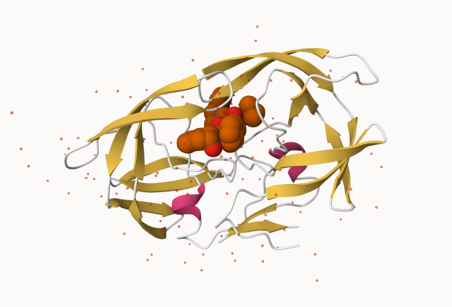
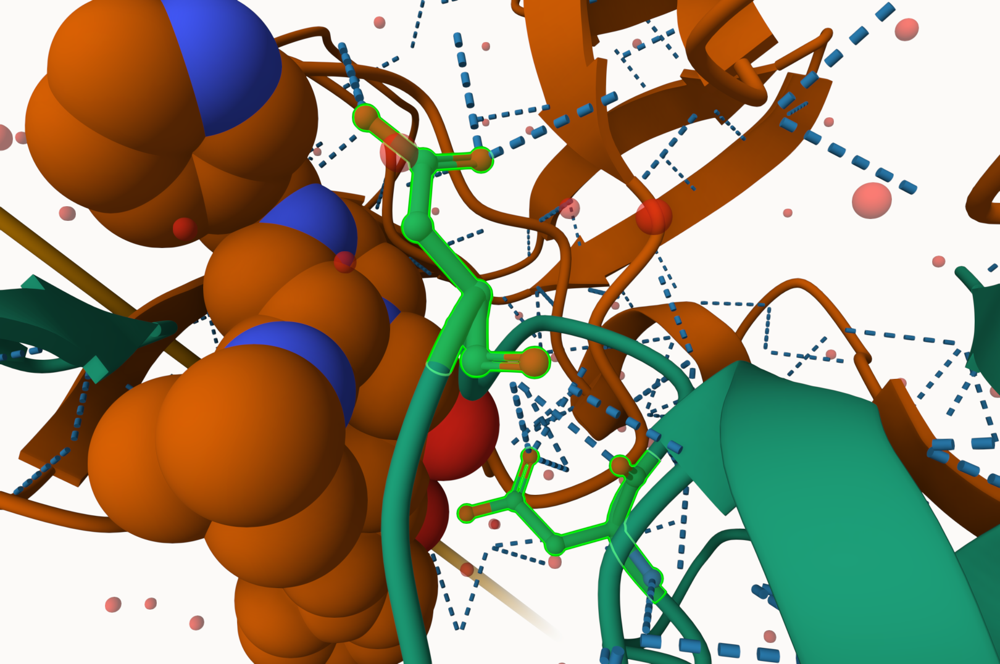
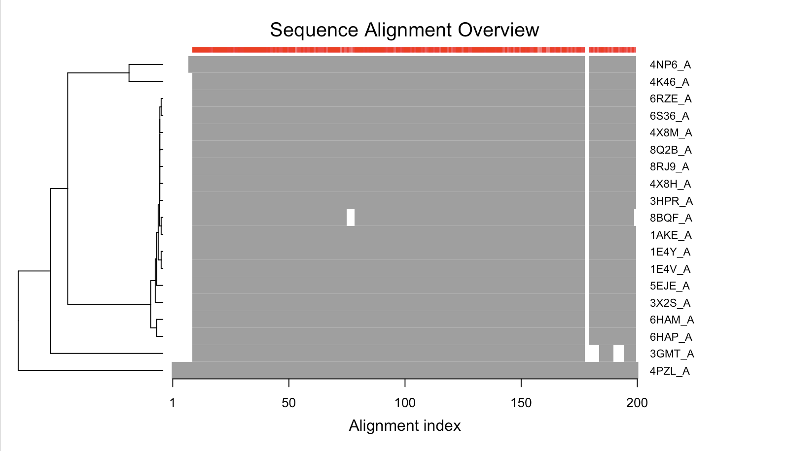
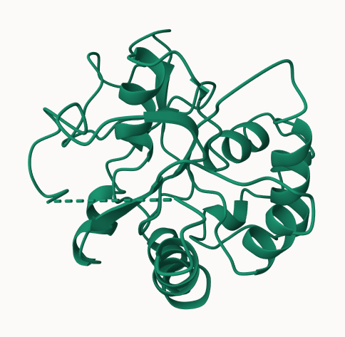

# class 9 : structural
Mia Fava

``` r
library(readr)
pdbdata <- read_csv("Data Export Summary.csv")
```

    Rows: 6 Columns: 8
    ── Column specification ────────────────────────────────────────────────────────
    Delimiter: ","
    chr (1): Molecular Type
    dbl (3): Multiple methods, Neutron, Other
    num (4): X-ray, EM, NMR, Total

    ℹ Use `spec()` to retrieve the full column specification for this data.
    ℹ Specify the column types or set `show_col_types = FALSE` to quiet this message.

``` r
head(pdbdata)
```

    # A tibble: 6 × 8
      `Molecular Type`   `X-ray`    EM   NMR `Multiple methods` Neutron Other  Total
      <chr>                <dbl> <dbl> <dbl>              <dbl>   <dbl> <dbl>  <dbl>
    1 Protein (only)      167317 15698 12534                208      77    32 195866
    2 Protein/Oligosacc…    9645  2639    34                  8       2     0  12328
    3 Protein/NA            8735  4718   286                  7       0     0  13746
    4 Nucleic acid (onl…    2869   138  1507                 14       3     1   4532
    5 Other                  170    10    33                  0       0     0    213
    6 Oligosaccharide (…      11     0     6                  1       0     4     22

> Q1: What percentage of structures in the PDB are solved by X-Ray and
> Electron Microscopy.

``` r
sum(pdbdata$`X-ray`)/sum(pdbdata$Total) *100
```

    [1] 83.25592

Percentage of Xray is 83.3%

``` r
sum(pdbdata$EM)/sum(pdbdata$Total) *100
```

    [1] 10.2348

Percentage of EM is 10.2%

> Q2: What proportion of structures in the PDB are protein?

``` r
pdbdata$Total[1]/sum(pdbdata$Total) *100
```

    [1] 86.3961

> Q3: Type HIV in the PDB website search box on the home page and
> determine how many HIV-1 protease structures are in the current PDB?

According to the search data base, there are 226,707 structures of HIV-1
protease.

\##Mol\*



> Q4: Water molecules normally have 3 atoms. Why do we see just one atom
> per water molecule in this structure?

There is only one atom per water molecule in this structure due to how
the single atom represents only the oxygen. Oxygen is more
electron-dense than hydrogen atoms, resulting in them being easier to
detect in comparison to hydrogen atoms.

> Q5: There is a critical “conserved” water molecule in the binding
> site. Can you identify this water molecule? What residue number does
> this water molecule have

The critical conserved water molecule for 1HSG residue number was seen
to be 301.

> Q6: Generate and save a figure clearly showing the two distinct chains
> of HIV-protease along with the ligand. You might also consider showing
> the catalytic residues ASP 25 in each chain and the critical water (we
> recommend “Ball & Stick” for these side-chains). Add this figure to
> your Quarto document. Discussion Topic: Can you think of a way in
> which indinavir, or even larger ligands and substrates, could enter
> the binding site?



> Q7: \[Optional\] As you have hopefully observed HIV protease is a
> homodimer (i.e. it is composed of two identical chains). With the aid
> of the graphic display can you identify secondary structure elements
> that are likely to only form in the dimer rather than the monomer?

The Beta sheets is an example of secondary structures that would form in
the dimer rather than the monomer. Another example would be the residue
arrangements of Asp25, as they are positioned where dimerization is
necessary for them to interact with each other.

\##Introduction to BIO3D

``` r
library(bio3d)
```

``` r
pdb <- read.pdb("1hsg")
```

      Note: Accessing on-line PDB file

``` r
pdb
```


     Call:  read.pdb(file = "1hsg")

       Total Models#: 1
         Total Atoms#: 1686,  XYZs#: 5058  Chains#: 2  (values: A B)

         Protein Atoms#: 1514  (residues/Calpha atoms#: 198)
         Nucleic acid Atoms#: 0  (residues/phosphate atoms#: 0)

         Non-protein/nucleic Atoms#: 172  (residues: 128)
         Non-protein/nucleic resid values: [ HOH (127), MK1 (1) ]

       Protein sequence:
          PQITLWQRPLVTIKIGGQLKEALLDTGADDTVLEEMSLPGRWKPKMIGGIGGFIKVRQYD
          QILIEICGHKAIGTVLVGPTPVNIIGRNLLTQIGCTLNFPQITLWQRPLVTIKIGGQLKE
          ALLDTGADDTVLEEMSLPGRWKPKMIGGIGGFIKVRQYDQILIEICGHKAIGTVLVGPTP
          VNIIGRNLLTQIGCTLNF

    + attr: atom, xyz, seqres, helix, sheet,
            calpha, remark, call

``` r
attributes(pdb)
```

    $names
    [1] "atom"   "xyz"    "seqres" "helix"  "sheet"  "calpha" "remark" "call"  

    $class
    [1] "pdb" "sse"

``` r
head(pdb$atom)
```

      type eleno elety  alt resid chain resno insert      x      y     z o     b
    1 ATOM     1     N <NA>   PRO     A     1   <NA> 29.361 39.686 5.862 1 38.10
    2 ATOM     2    CA <NA>   PRO     A     1   <NA> 30.307 38.663 5.319 1 40.62
    3 ATOM     3     C <NA>   PRO     A     1   <NA> 29.760 38.071 4.022 1 42.64
    4 ATOM     4     O <NA>   PRO     A     1   <NA> 28.600 38.302 3.676 1 43.40
    5 ATOM     5    CB <NA>   PRO     A     1   <NA> 30.508 37.541 6.342 1 37.87
    6 ATOM     6    CG <NA>   PRO     A     1   <NA> 29.296 37.591 7.162 1 38.40
      segid elesy charge
    1  <NA>     N   <NA>
    2  <NA>     C   <NA>
    3  <NA>     C   <NA>
    4  <NA>     O   <NA>
    5  <NA>     C   <NA>
    6  <NA>     C   <NA>

``` r
adk <- read.pdb("6s36")
```

      Note: Accessing on-line PDB file
       PDB has ALT records, taking A only, rm.alt=TRUE

``` r
adk
```


     Call:  read.pdb(file = "6s36")

       Total Models#: 1
         Total Atoms#: 1898,  XYZs#: 5694  Chains#: 1  (values: A)

         Protein Atoms#: 1654  (residues/Calpha atoms#: 214)
         Nucleic acid Atoms#: 0  (residues/phosphate atoms#: 0)

         Non-protein/nucleic Atoms#: 244  (residues: 244)
         Non-protein/nucleic resid values: [ CL (3), HOH (238), MG (2), NA (1) ]

       Protein sequence:
          MRIILLGAPGAGKGTQAQFIMEKYGIPQISTGDMLRAAVKSGSELGKQAKDIMDAGKLVT
          DELVIALVKERIAQEDCRNGFLLDGFPRTIPQADAMKEAGINVDYVLEFDVPDELIVDKI
          VGRRVHAPSGRVYHVKFNPPKVEGKDDVTGEELTTRKDDQEETVRKRLVEYHQMTAPLIG
          YYSKEAEAGNTKYAKVDGTKPVAEVRADLEKILG

    + attr: atom, xyz, seqres, helix, sheet,
            calpha, remark, call

``` r
# Perform flexiblity prediction
m <- nma(adk)
```

     Building Hessian...        Done in 0.013 seconds.
     Diagonalizing Hessian...   Done in 0.284 seconds.

``` r
plot(m)
```


``` r
mktrj(m, file="adk_m7.pdb")
```

\##Comparative analysis of Adenylate Kinase

``` r
library(bio3d)
aa <- get.seq("1ake_A")
```

    Warning in get.seq("1ake_A"): Removing existing file: seqs.fasta

    Fetching... Please wait. Done.

``` r
aa
```

                 1        .         .         .         .         .         60 
    pdb|1AKE|A   MRIILLGAPGAGKGTQAQFIMEKYGIPQISTGDMLRAAVKSGSELGKQAKDIMDAGKLVT
                 1        .         .         .         .         .         60 

                61        .         .         .         .         .         120 
    pdb|1AKE|A   DELVIALVKERIAQEDCRNGFLLDGFPRTIPQADAMKEAGINVDYVLEFDVPDELIVDRI
                61        .         .         .         .         .         120 

               121        .         .         .         .         .         180 
    pdb|1AKE|A   VGRRVHAPSGRVYHVKFNPPKVEGKDDVTGEELTTRKDDQEETVRKRLVEYHQMTAPLIG
               121        .         .         .         .         .         180 

               181        .         .         .   214 
    pdb|1AKE|A   YYSKEAEAGNTKYAKVDGTKPVAEVRADLEKILG
               181        .         .         .   214 

    Call:
      read.fasta(file = outfile)

    Class:
      fasta

    Alignment dimensions:
      1 sequence rows; 214 position columns (214 non-gap, 0 gap) 

    + attr: id, ali, call

``` r
# Blast or hmmer search 
b <- blast.pdb(aa)
```

     Searching ... please wait (updates every 5 seconds) RID = N408VHDE013 
     .
     Reporting 86 hits

Plot a summary of search results

``` r
hits <- plot(b)
```

      * Possible cutoff values:    197 11 
                Yielding Nhits:    19 86 

      * Chosen cutoff value of:    197 
                Yielding Nhits:    19 


``` r
head(hits$pdb.id)
```

    [1] "1AKE_A" "8BQF_A" "4X8M_A" "6S36_A" "8Q2B_A" "8RJ9_A"

``` r
files <- get.pdb(hits$pdb.id, path="pdbs", split=TRUE, gzip=TRUE)
```

    Warning in get.pdb(hits$pdb.id, path = "pdbs", split = TRUE, gzip = TRUE):
    pdbs/1AKE.pdb.gz exists. Skipping download

    Warning in get.pdb(hits$pdb.id, path = "pdbs", split = TRUE, gzip = TRUE):
    pdbs/8BQF.pdb.gz exists. Skipping download

    Warning in get.pdb(hits$pdb.id, path = "pdbs", split = TRUE, gzip = TRUE):
    pdbs/4X8M.pdb.gz exists. Skipping download

    Warning in get.pdb(hits$pdb.id, path = "pdbs", split = TRUE, gzip = TRUE):
    pdbs/6S36.pdb.gz exists. Skipping download

    Warning in get.pdb(hits$pdb.id, path = "pdbs", split = TRUE, gzip = TRUE):
    pdbs/8Q2B.pdb.gz exists. Skipping download

    Warning in get.pdb(hits$pdb.id, path = "pdbs", split = TRUE, gzip = TRUE):
    pdbs/8RJ9.pdb.gz exists. Skipping download

    Warning in get.pdb(hits$pdb.id, path = "pdbs", split = TRUE, gzip = TRUE):
    pdbs/6RZE.pdb.gz exists. Skipping download

    Warning in get.pdb(hits$pdb.id, path = "pdbs", split = TRUE, gzip = TRUE):
    pdbs/4X8H.pdb.gz exists. Skipping download

    Warning in get.pdb(hits$pdb.id, path = "pdbs", split = TRUE, gzip = TRUE):
    pdbs/3HPR.pdb.gz exists. Skipping download

    Warning in get.pdb(hits$pdb.id, path = "pdbs", split = TRUE, gzip = TRUE):
    pdbs/1E4V.pdb.gz exists. Skipping download

    Warning in get.pdb(hits$pdb.id, path = "pdbs", split = TRUE, gzip = TRUE):
    pdbs/5EJE.pdb.gz exists. Skipping download

    Warning in get.pdb(hits$pdb.id, path = "pdbs", split = TRUE, gzip = TRUE):
    pdbs/1E4Y.pdb.gz exists. Skipping download

    Warning in get.pdb(hits$pdb.id, path = "pdbs", split = TRUE, gzip = TRUE):
    pdbs/3X2S.pdb.gz exists. Skipping download

    Warning in get.pdb(hits$pdb.id, path = "pdbs", split = TRUE, gzip = TRUE):
    pdbs/6HAP.pdb.gz exists. Skipping download

    Warning in get.pdb(hits$pdb.id, path = "pdbs", split = TRUE, gzip = TRUE):
    pdbs/6HAM.pdb.gz exists. Skipping download

    Warning in get.pdb(hits$pdb.id, path = "pdbs", split = TRUE, gzip = TRUE):
    pdbs/4K46.pdb.gz exists. Skipping download

    Warning in get.pdb(hits$pdb.id, path = "pdbs", split = TRUE, gzip = TRUE):
    pdbs/4NP6.pdb.gz exists. Skipping download

    Warning in get.pdb(hits$pdb.id, path = "pdbs", split = TRUE, gzip = TRUE):
    pdbs/3GMT.pdb.gz exists. Skipping download

    Warning in get.pdb(hits$pdb.id, path = "pdbs", split = TRUE, gzip = TRUE):
    pdbs/4PZL.pdb.gz exists. Skipping download


      |                                                                            
      |                                                                      |   0%
      |                                                                            
      |====                                                                  |   5%
      |                                                                            
      |=======                                                               |  11%
      |                                                                            
      |===========                                                           |  16%
      |                                                                            
      |===============                                                       |  21%
      |                                                                            
      |==================                                                    |  26%
      |                                                                            
      |======================                                                |  32%
      |                                                                            
      |==========================                                            |  37%
      |                                                                            
      |=============================                                         |  42%
      |                                                                            
      |=================================                                     |  47%
      |                                                                            
      |=====================================                                 |  53%
      |                                                                            
      |=========================================                             |  58%
      |                                                                            
      |============================================                          |  63%
      |                                                                            
      |================================================                      |  68%
      |                                                                            
      |====================================================                  |  74%
      |                                                                            
      |=======================================================               |  79%
      |                                                                            
      |===========================================================           |  84%
      |                                                                            
      |===============================================================       |  89%
      |                                                                            
      |==================================================================    |  95%
      |                                                                            
      |======================================================================| 100%

``` r
pdbs <- pdbaln(files, fit = TRUE, exefile="msa")
```

    Reading PDB files:
    pdbs/split_chain/1AKE_A.pdb
    pdbs/split_chain/8BQF_A.pdb
    pdbs/split_chain/4X8M_A.pdb
    pdbs/split_chain/6S36_A.pdb
    pdbs/split_chain/8Q2B_A.pdb
    pdbs/split_chain/8RJ9_A.pdb
    pdbs/split_chain/6RZE_A.pdb
    pdbs/split_chain/4X8H_A.pdb
    pdbs/split_chain/3HPR_A.pdb
    pdbs/split_chain/1E4V_A.pdb
    pdbs/split_chain/5EJE_A.pdb
    pdbs/split_chain/1E4Y_A.pdb
    pdbs/split_chain/3X2S_A.pdb
    pdbs/split_chain/6HAP_A.pdb
    pdbs/split_chain/6HAM_A.pdb
    pdbs/split_chain/4K46_A.pdb
    pdbs/split_chain/4NP6_A.pdb
    pdbs/split_chain/3GMT_A.pdb
    pdbs/split_chain/4PZL_A.pdb
       PDB has ALT records, taking A only, rm.alt=TRUE
    .   PDB has ALT records, taking A only, rm.alt=TRUE
    ..   PDB has ALT records, taking A only, rm.alt=TRUE
    .   PDB has ALT records, taking A only, rm.alt=TRUE
    .   PDB has ALT records, taking A only, rm.alt=TRUE
    .   PDB has ALT records, taking A only, rm.alt=TRUE
    ..   PDB has ALT records, taking A only, rm.alt=TRUE
    ..   PDB has ALT records, taking A only, rm.alt=TRUE
    ....   PDB has ALT records, taking A only, rm.alt=TRUE
    .   PDB has ALT records, taking A only, rm.alt=TRUE
    ....

    Extracting sequences

    pdb/seq: 1   name: pdbs/split_chain/1AKE_A.pdb 
       PDB has ALT records, taking A only, rm.alt=TRUE
    pdb/seq: 2   name: pdbs/split_chain/8BQF_A.pdb 
       PDB has ALT records, taking A only, rm.alt=TRUE
    pdb/seq: 3   name: pdbs/split_chain/4X8M_A.pdb 
    pdb/seq: 4   name: pdbs/split_chain/6S36_A.pdb 
       PDB has ALT records, taking A only, rm.alt=TRUE
    pdb/seq: 5   name: pdbs/split_chain/8Q2B_A.pdb 
       PDB has ALT records, taking A only, rm.alt=TRUE
    pdb/seq: 6   name: pdbs/split_chain/8RJ9_A.pdb 
       PDB has ALT records, taking A only, rm.alt=TRUE
    pdb/seq: 7   name: pdbs/split_chain/6RZE_A.pdb 
       PDB has ALT records, taking A only, rm.alt=TRUE
    pdb/seq: 8   name: pdbs/split_chain/4X8H_A.pdb 
    pdb/seq: 9   name: pdbs/split_chain/3HPR_A.pdb 
       PDB has ALT records, taking A only, rm.alt=TRUE
    pdb/seq: 10   name: pdbs/split_chain/1E4V_A.pdb 
    pdb/seq: 11   name: pdbs/split_chain/5EJE_A.pdb 
       PDB has ALT records, taking A only, rm.alt=TRUE
    pdb/seq: 12   name: pdbs/split_chain/1E4Y_A.pdb 
    pdb/seq: 13   name: pdbs/split_chain/3X2S_A.pdb 
    pdb/seq: 14   name: pdbs/split_chain/6HAP_A.pdb 
    pdb/seq: 15   name: pdbs/split_chain/6HAM_A.pdb 
       PDB has ALT records, taking A only, rm.alt=TRUE
    pdb/seq: 16   name: pdbs/split_chain/4K46_A.pdb 
       PDB has ALT records, taking A only, rm.alt=TRUE
    pdb/seq: 17   name: pdbs/split_chain/4NP6_A.pdb 
    pdb/seq: 18   name: pdbs/split_chain/3GMT_A.pdb 
    pdb/seq: 19   name: pdbs/split_chain/4PZL_A.pdb 

``` r
library(bio3d)
# vector containing PDB codes for figure axis
ids <- basename.pdb(pdbs$id)

# schematic alignment
plot(pdbs, labels=ids)
```


``` r
str(pdbs)
```

    List of 9
     $ xyz  : 'xyz' num [1:19, 1:681] NA NA NA NA NA NA NA NA NA NA ...
      ..- attr(*, "dimnames")=List of 2
      .. ..$ : chr [1:19] "pdbs/split_chain/1AKE_A.pdb" "pdbs/split_chain/8BQF_A.pdb" "pdbs/split_chain/4X8M_A.pdb" "pdbs/split_chain/6S36_A.pdb" ...
      .. ..$ : NULL
     $ resno: int [1:19, 1:227] NA NA NA NA NA NA NA NA NA NA ...
      ..- attr(*, "dimnames")=List of 2
      .. ..$ : chr [1:19] "pdbs/split_chain/1AKE_A.pdb" "pdbs/split_chain/8BQF_A.pdb" "pdbs/split_chain/4X8M_A.pdb" "pdbs/split_chain/6S36_A.pdb" ...
      .. ..$ : NULL
     $ b    : num [1:19, 1:227] NA NA NA NA NA NA NA NA NA NA ...
      ..- attr(*, "dimnames")=List of 2
      .. ..$ : chr [1:19] "pdbs/split_chain/1AKE_A.pdb" "pdbs/split_chain/8BQF_A.pdb" "pdbs/split_chain/4X8M_A.pdb" "pdbs/split_chain/6S36_A.pdb" ...
      .. ..$ : NULL
     $ chain: chr [1:19, 1:227] NA NA NA NA ...
      ..- attr(*, "dimnames")=List of 2
      .. ..$ : chr [1:19] "pdbs/split_chain/1AKE_A.pdb" "pdbs/split_chain/8BQF_A.pdb" "pdbs/split_chain/4X8M_A.pdb" "pdbs/split_chain/6S36_A.pdb" ...
      .. ..$ : NULL
     $ id   : chr [1:19] "pdbs/split_chain/1AKE_A.pdb" "pdbs/split_chain/8BQF_A.pdb" "pdbs/split_chain/4X8M_A.pdb" "pdbs/split_chain/6S36_A.pdb" ...
     $ ali  : chr [1:19, 1:227] "-" "-" "-" "-" ...
      ..- attr(*, "dimnames")=List of 2
      .. ..$ : chr [1:19] "pdbs/split_chain/1AKE_A.pdb" "pdbs/split_chain/8BQF_A.pdb" "pdbs/split_chain/4X8M_A.pdb" "pdbs/split_chain/6S36_A.pdb" ...
      .. ..$ : NULL
     $ resid: chr [1:19, 1:227] NA NA NA NA ...
      ..- attr(*, "dimnames")=List of 2
      .. ..$ : chr [1:19] "pdbs/split_chain/1AKE_A.pdb" "pdbs/split_chain/8BQF_A.pdb" "pdbs/split_chain/4X8M_A.pdb" "pdbs/split_chain/6S36_A.pdb" ...
      .. ..$ : NULL
     $ sse  : chr [1:19, 1:227] NA NA NA NA ...
      ..- attr(*, "dimnames")=List of 2
      .. ..$ : chr [1:19] "pdbs/split_chain/1AKE_A.pdb" "pdbs/split_chain/8BQF_A.pdb" "pdbs/split_chain/4X8M_A.pdb" "pdbs/split_chain/6S36_A.pdb" ...
      .. ..$ : NULL
     $ call : language pdbaln(files = files, fit = TRUE, exefile = "msa")
     - attr(*, "class")= chr [1:2] "pdbs" "fasta"



``` r
anno <- pdb.annotate(ids)
unique(anno$source)
```

    [1] "Escherichia coli"                                
    [2] "Escherichia coli K-12"                           
    [3] "Escherichia coli O139:H28 str. E24377A"          
    [4] "Escherichia coli str. K-12 substr. MDS42"        
    [5] "Photobacterium profundum"                        
    [6] "Vibrio cholerae O1 biovar El Tor str. N16961"    
    [7] "Burkholderia pseudomallei 1710b"                 
    [8] "Francisella tularensis subsp. tularensis SCHU S4"

``` r
anno
```

           structureId chainId macromoleculeType chainLength experimentalTechnique
    1AKE_A        1AKE       A           Protein         214                 X-ray
    8BQF_A        8BQF       A           Protein         234                 X-ray
    4X8M_A        4X8M       A           Protein         214                 X-ray
    6S36_A        6S36       A           Protein         214                 X-ray
    8Q2B_A        8Q2B       A           Protein         214                 X-ray
    8RJ9_A        8RJ9       A           Protein         214                 X-ray
    6RZE_A        6RZE       A           Protein         214                 X-ray
    4X8H_A        4X8H       A           Protein         214                 X-ray
    3HPR_A        3HPR       A           Protein         214                 X-ray
    1E4V_A        1E4V       A           Protein         214                 X-ray
    5EJE_A        5EJE       A           Protein         214                 X-ray
    1E4Y_A        1E4Y       A           Protein         214                 X-ray
    3X2S_A        3X2S       A           Protein         214                 X-ray
    6HAP_A        6HAP       A           Protein         214                 X-ray
    6HAM_A        6HAM       A           Protein         214                 X-ray
    4K46_A        4K46       A           Protein         214                 X-ray
    4NP6_A        4NP6       A           Protein         217                 X-ray
    3GMT_A        3GMT       A           Protein         230                 X-ray
    4PZL_A        4PZL       A           Protein         242                 X-ray
           resolution       scopDomain                                        pfam
    1AKE_A      2.000 Adenylate kinase Adenylate kinase, active site lid (ADK_lid)
    8BQF_A      2.050             <NA> Adenylate kinase, active site lid (ADK_lid)
    4X8M_A      2.600             <NA> Adenylate kinase, active site lid (ADK_lid)
    6S36_A      1.600             <NA>                      Adenylate kinase (ADK)
    8Q2B_A      1.760             <NA>                      Adenylate kinase (ADK)
    8RJ9_A      1.590             <NA>                      Adenylate kinase (ADK)
    6RZE_A      1.690             <NA>                      Adenylate kinase (ADK)
    4X8H_A      2.500             <NA>                      Adenylate kinase (ADK)
    3HPR_A      2.000             <NA>                      Adenylate kinase (ADK)
    1E4V_A      1.850 Adenylate kinase                      Adenylate kinase (ADK)
    5EJE_A      1.900             <NA>                      Adenylate kinase (ADK)
    1E4Y_A      1.850 Adenylate kinase                      Adenylate kinase (ADK)
    3X2S_A      2.800             <NA>                      Adenylate kinase (ADK)
    6HAP_A      2.700             <NA>                      Adenylate kinase (ADK)
    6HAM_A      2.550             <NA>                      Adenylate kinase (ADK)
    4K46_A      2.010             <NA>                      Adenylate kinase (ADK)
    4NP6_A      2.004             <NA>                      Adenylate kinase (ADK)
    3GMT_A      2.100             <NA> Adenylate kinase, active site lid (ADK_lid)
    4PZL_A      2.100             <NA>                      Adenylate kinase (ADK)
                   ligandId
    1AKE_A              AP5
    8BQF_A              AP5
    4X8M_A             <NA>
    6S36_A CL (3),NA,MG (2)
    8Q2B_A      AP5,SO4,MPO
    8RJ9_A          ADP (2)
    6RZE_A    NA (3),CL (2)
    4X8H_A             <NA>
    3HPR_A              AP5
    1E4V_A              AP5
    5EJE_A           AP5,CO
    1E4Y_A              AP5
    3X2S_A   JPY (2),AP5,MG
    6HAP_A              AP5
    6HAM_A              AP5
    4K46_A      ADP,AMP,PO4
    4NP6_A             <NA>
    3GMT_A          SO4 (2)
    4PZL_A       CA,FMT,GOL
                                                                                  ligandName
    1AKE_A                                                  BIS(ADENOSINE)-5'-PENTAPHOSPHATE
    8BQF_A                                                  BIS(ADENOSINE)-5'-PENTAPHOSPHATE
    4X8M_A                                                                              <NA>
    6S36_A                                     CHLORIDE ION (3),SODIUM ION,MAGNESIUM ION (2)
    8Q2B_A BIS(ADENOSINE)-5'-PENTAPHOSPHATE,SULFATE ION,3[N-MORPHOLINO]PROPANE SULFONIC ACID
    8RJ9_A                                                      ADENOSINE-5'-DIPHOSPHATE (2)
    6RZE_A                                                   SODIUM ION (3),CHLORIDE ION (2)
    4X8H_A                                                                              <NA>
    3HPR_A                                                  BIS(ADENOSINE)-5'-PENTAPHOSPHATE
    1E4V_A                                                  BIS(ADENOSINE)-5'-PENTAPHOSPHATE
    5EJE_A                                  BIS(ADENOSINE)-5'-PENTAPHOSPHATE,COBALT (II) ION
    1E4Y_A                                                  BIS(ADENOSINE)-5'-PENTAPHOSPHATE
    3X2S_A  N-(pyren-1-ylmethyl)acetamide (2),BIS(ADENOSINE)-5'-PENTAPHOSPHATE,MAGNESIUM ION
    6HAP_A                                                  BIS(ADENOSINE)-5'-PENTAPHOSPHATE
    6HAM_A                                                  BIS(ADENOSINE)-5'-PENTAPHOSPHATE
    4K46_A                    ADENOSINE-5'-DIPHOSPHATE,ADENOSINE MONOPHOSPHATE,PHOSPHATE ION
    4NP6_A                                                                              <NA>
    3GMT_A                                                                   SULFATE ION (2)
    4PZL_A                                                  CALCIUM ION,FORMIC ACID,GLYCEROL
                                                     source
    1AKE_A                                 Escherichia coli
    8BQF_A                                 Escherichia coli
    4X8M_A                                 Escherichia coli
    6S36_A                                 Escherichia coli
    8Q2B_A                                 Escherichia coli
    8RJ9_A                                 Escherichia coli
    6RZE_A                                 Escherichia coli
    4X8H_A                                 Escherichia coli
    3HPR_A                            Escherichia coli K-12
    1E4V_A                                 Escherichia coli
    5EJE_A           Escherichia coli O139:H28 str. E24377A
    1E4Y_A                                 Escherichia coli
    3X2S_A         Escherichia coli str. K-12 substr. MDS42
    6HAP_A           Escherichia coli O139:H28 str. E24377A
    6HAM_A                            Escherichia coli K-12
    4K46_A                         Photobacterium profundum
    4NP6_A     Vibrio cholerae O1 biovar El Tor str. N16961
    3GMT_A                  Burkholderia pseudomallei 1710b
    4PZL_A Francisella tularensis subsp. tularensis SCHU S4
                                                                                                                                                                         structureTitle
    1AKE_A STRUCTURE OF THE COMPLEX BETWEEN ADENYLATE KINASE FROM ESCHERICHIA COLI AND THE INHIBITOR AP5A REFINED AT 1.9 ANGSTROMS RESOLUTION: A MODEL FOR A CATALYTIC TRANSITION STATE
    8BQF_A                                                                                                                                                Adenylate Kinase L107I MUTANT
    4X8M_A                                                                                                                   Crystal structure of E. coli Adenylate kinase Y171W mutant
    6S36_A                                                                                                                   Crystal structure of E. coli Adenylate kinase R119K mutant
    8Q2B_A                                              E. coli Adenylate Kinase variant D158A (AK D158A) showing significant changes to the stacking of catalytic arginine side chains
    8RJ9_A                                                        E. coli adenylate kinase Asp84Ala variant in complex with two ADP molecules as a result of enzymatic AP4A hydrolysis.
    6RZE_A                                                                                                                   Crystal structure of E. coli Adenylate kinase R119A mutant
    4X8H_A                                                                                                                   Crystal structure of E. coli Adenylate kinase P177A mutant
    3HPR_A                                                                                               Crystal structure of V148G adenylate kinase from E. coli, in complex with Ap5A
    1E4V_A                                                                                                       Mutant G10V of adenylate kinase from E. coli, modified in the Gly-loop
    5EJE_A                                                                                  Crystal structure of E. coli Adenylate kinase G56C/T163C double mutant in complex with Ap5a
    1E4Y_A                                                                                                        Mutant P9L of adenylate kinase from E. coli, modified in the Gly-loop
    3X2S_A                                                                                                                      Crystal structure of pyrene-conjugated adenylate kinase
    6HAP_A                                                                                                                                                             Adenylate kinase
    6HAM_A                                                                                                                                                             Adenylate kinase
    4K46_A                                                                                                          Crystal Structure of Adenylate Kinase from Photobacterium profundum
    4NP6_A                                                                                                   Crystal Structure of Adenylate Kinase from Vibrio cholerae O1 biovar eltor
    3GMT_A                                                                                                         Crystal structure of adenylate kinase from burkholderia pseudomallei
    4PZL_A                                                                              The crystal structure of adenylate kinase from Francisella tularensis subsp. tularensis SCHU S4
                                                         citation rObserved   rFree
    1AKE_A                 Muller, C.W., et al. J Mol Biol (1992)   0.19600      NA
    8BQF_A   Scheerer, D., et al. Proc Natl Acad Sci U S A (2023)   0.22073 0.25789
    4X8M_A                Kovermann, M., et al. Nat Commun (2015)   0.24910 0.30890
    6S36_A                  Rogne, P., et al. Biochemistry (2019)   0.16320 0.23560
    8Q2B_A                Nam, K., et al. J Chem Inf Model (2024)   0.18320 0.22440
    8RJ9_A                         Nam, K., et al. Sci Adv (2024)   0.15190 0.20290
    6RZE_A                  Rogne, P., et al. Biochemistry (2019)   0.18650 0.23500
    4X8H_A                Kovermann, M., et al. Nat Commun (2015)   0.19610 0.28950
    3HPR_A  Schrank, T.P., et al. Proc Natl Acad Sci U S A (2009)   0.21000 0.24320
    1E4V_A                   Muller, C.W., et al. Proteins (1993)   0.19600      NA
    5EJE_A  Kovermann, M., et al. Proc Natl Acad Sci U S A (2017)   0.18890 0.23580
    1E4Y_A                   Muller, C.W., et al. Proteins (1993)   0.17800      NA
    3X2S_A                Fujii, A., et al. Bioconjug Chem (2015)   0.20700 0.25600
    6HAP_A               Kantaev, R., et al. J Phys Chem B (2018)   0.22630 0.27760
    6HAM_A               Kantaev, R., et al. J Phys Chem B (2018)   0.20511 0.24325
    4K46_A                    Cho, Y.-J., et al. To be published    0.17000 0.22290
    4NP6_A                       Kim, Y., et al. To be published    0.18800 0.22200
    3GMT_A Buchko, G.W., et al. Biochem Biophys Res Commun (2010)   0.23800 0.29500
    4PZL_A                       Tan, K., et al. To be published    0.19360 0.23680
             rWork spaceGroup
    1AKE_A 0.19600  P 21 2 21
    8BQF_A 0.21882  P 2 21 21
    4X8M_A 0.24630    C 1 2 1
    6S36_A 0.15940    C 1 2 1
    8Q2B_A 0.18100   P 1 21 1
    8RJ9_A 0.15010  P 21 21 2
    6RZE_A 0.18190    C 1 2 1
    4X8H_A 0.19140    C 1 2 1
    3HPR_A 0.20620  P 21 21 2
    1E4V_A 0.19600  P 21 2 21
    5EJE_A 0.18630  P 21 2 21
    1E4Y_A 0.17800   P 1 21 1
    3X2S_A 0.20700 P 21 21 21
    6HAP_A 0.22370    I 2 2 2
    6HAM_A 0.20311       P 43
    4K46_A 0.16730 P 21 21 21
    4NP6_A 0.18600       P 43
    3GMT_A 0.23500   P 1 21 1
    4PZL_A 0.19130       P 32

``` r
# Perform PCA
pc.xray <- pca(pdbs)
plot(pc.xray)
```


``` r
rd <- rmsd(pdbs)
```

    Warning in rmsd(pdbs): No indices provided, using the 199 non NA positions

``` r
hc.rd <- hclust(dist(rd))
grps.rd <- cutree(hc.rd, k=3)

print(plot(pc.xray, 1:2, col="grey50", bg=grps.rd, pch=21, cex=1))
```


                                     [,1]        [,2]
    pdbs/split_chain/1AKE_A.pdb -39.03740   3.0421850
    pdbs/split_chain/8BQF_A.pdb -36.37905   2.4249533
    pdbs/split_chain/4X8M_A.pdb  59.65065 -16.1779052
    pdbs/split_chain/6S36_A.pdb  60.14366 -13.8206057
    pdbs/split_chain/8Q2B_A.pdb -33.27350   1.1612328
    pdbs/split_chain/8RJ9_A.pdb -41.51263   3.5939187
    pdbs/split_chain/6RZE_A.pdb  61.36041 -13.6961278
    pdbs/split_chain/4X8H_A.pdb  61.29688 -14.1643852
    pdbs/split_chain/3HPR_A.pdb -40.24653   2.7785289
    pdbs/split_chain/1E4V_A.pdb -38.73611   2.8738870
    pdbs/split_chain/5EJE_A.pdb -39.20371   3.1681058
    pdbs/split_chain/1E4Y_A.pdb -34.30994   0.9572993
    pdbs/split_chain/3X2S_A.pdb -39.98943   3.9793904
    pdbs/split_chain/6HAP_A.pdb -27.50232   0.9631241
    pdbs/split_chain/6HAM_A.pdb -35.45248   2.6237571
    pdbs/split_chain/4K46_A.pdb -43.17271   3.0175923
    pdbs/split_chain/4NP6_A.pdb  50.42370 -18.1043626
    pdbs/split_chain/3GMT_A.pdb 102.99489  63.9179475
    pdbs/split_chain/4PZL_A.pdb  52.94564 -18.5385358

\##Optional Further Investigation

``` r
# Visualize first principal component
pc1 <- mktrj(pc.xray, pc=1, file="pc_1.pdb")
```

``` r
library(ggplot2)
library(ggrepel)
```

``` r
df <- data.frame(PC1=pc.xray$z[,1], 
                 PC2=pc.xray$z[,2], 
                 col=as.factor(grps.rd),
                 ids=ids)

p <- ggplot(df) + 
  aes(PC1, PC2, col=col, label=ids) +
  geom_point(size=2) +
  geom_text_repel(max.overlaps = 20) +
  theme(legend.position = "none")
p
```

    Warning: ggrepel: 6 unlabeled data points (too many overlaps). Consider
    increasing max.overlaps


## Optional futher visualization

``` r
pc1 <- mktrj(pc.xray, pc=1, file="pc_1.pdb")
```



``` r
uniprot <-248838887
pdb <- 195610

pdb/uniprot * 100
```

    [1] 0.0786091
